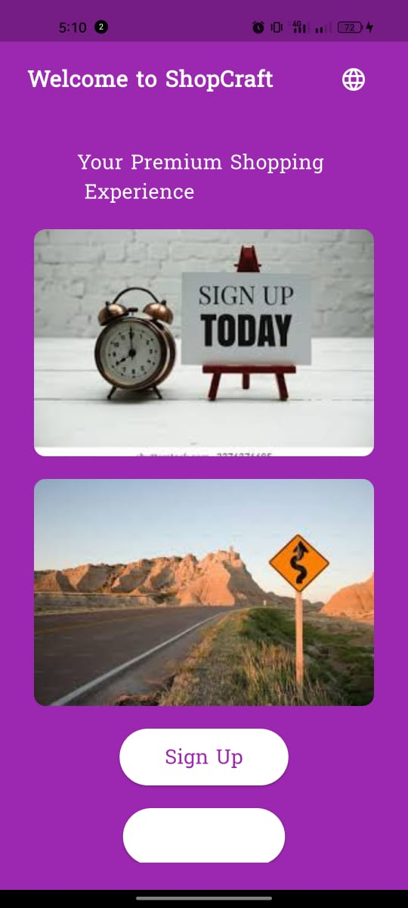
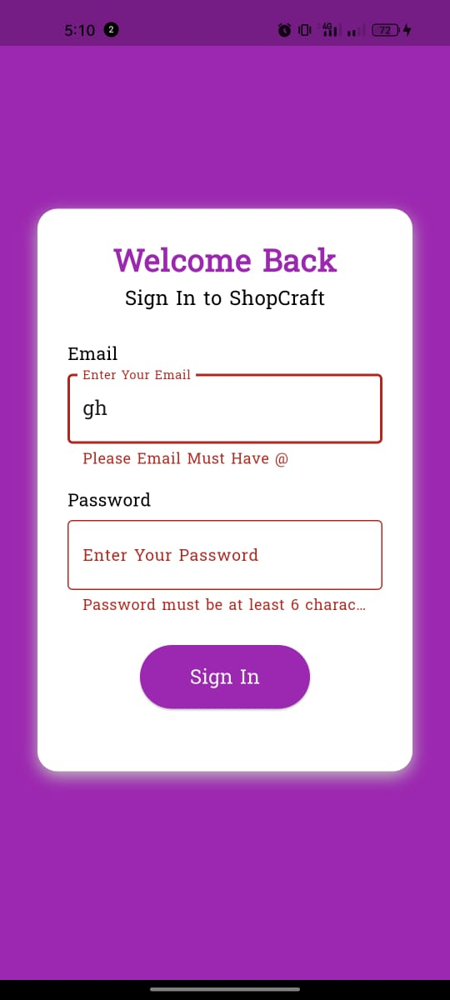
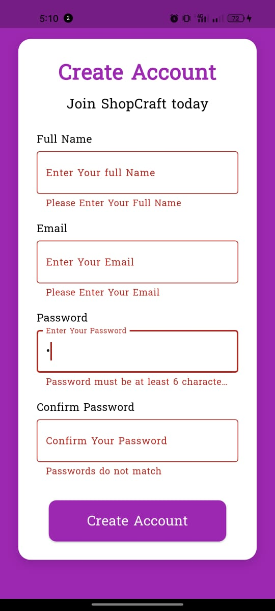
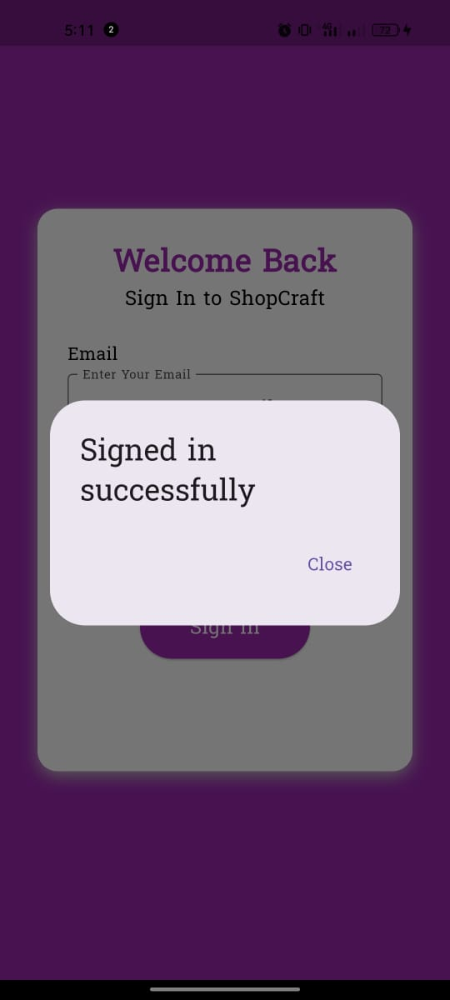
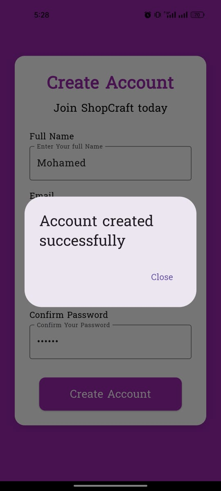
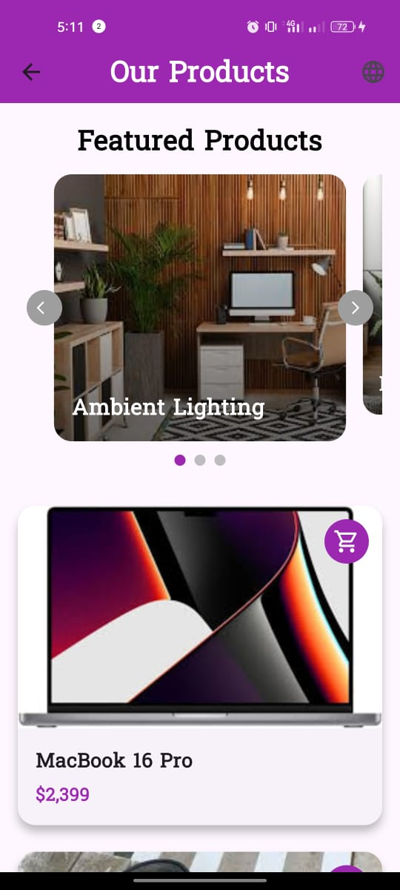
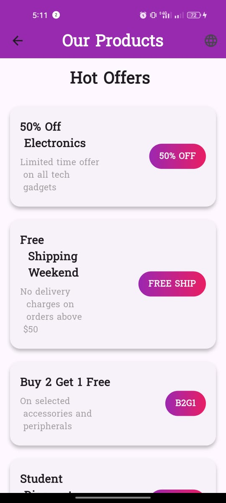
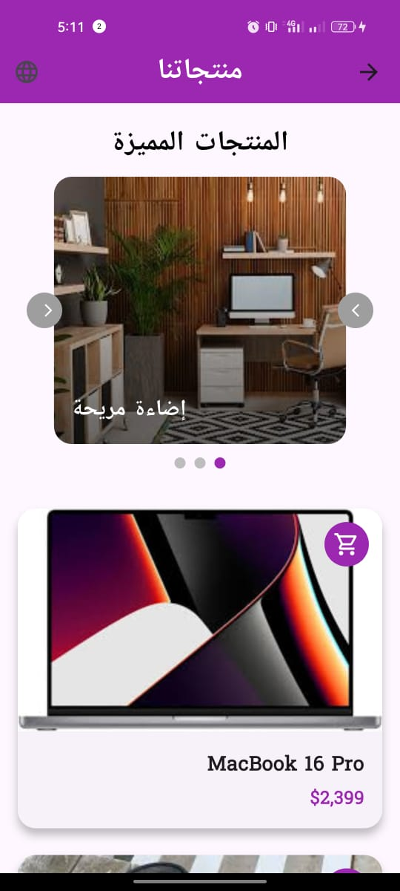

# 🛍️ ShopCraft - Flutter Shopping App

ShopCraft is a modern and beautifully designed Flutter shopping app that supports both **Arabic and English**.  
The app includes onboarding, login, registration, product listings, offers, and animated transitions between pages.

---

## 📱 Screenshots

### 🇺🇸 English

<p float="left">
  
  
  
  
  
  
  
  
</p>

---

### 🇸🇦 Arabic

<p float="left">
  
  
  
  
  
  
  
</p>

---

## 🌟 Features

- 🔐 Sign Up & Sign In screens
- 🏠 Home screen with featured products
- 🎯 Animated product slider with arrows and indicator dots
- 💥 Offers section with localization
- 🌍 Switch language (English / Arabic) from anywhere
- 🧭 Smooth page transitions (fade animation)
- 📱 Responsive layout

---

## 🧩 Dependencies

- `flutter_localizations`
- `provider`
- `intl`

---

## 🌐 Localization

Supports both **Arabic 🇸🇦** and **English 🇺🇸** using `arb` files and Flutter’s localization tools.

To switch language, use the 🌐 button in the top bar.

---

## 🚀 Getting Started

1. Clone the repo:

```bash
git clone https://github.com/your-username/shopping_app.git
cd shopping_app
